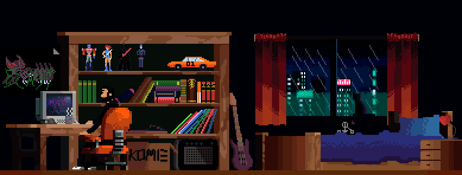

<h4 align="left">I am a 4th Year Student at Pimpri Chinchwad College of Engineering pursuing B.Tech in CSE. I'm a passionate developer, learner, and explorer. I love to build and experiment with new technologies. I am an enthusiastic and a social person who loves to take up new challenges and learn new skills.</h4>
 

 

## Web development

 

## Frameworks

 

## OS

 

## Languages

 

## Tools and Technologies

 

## Coding Profiles

 

## Github Statistics 
 

- 🔭 I’m currently working on **CryptoMarket**

- 🌱 I’m currently learning **Kotlin, Android Development, React.js, Node.js**

 

## Contact Me

 
